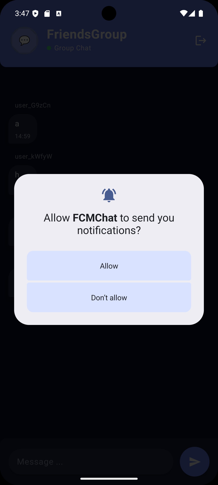
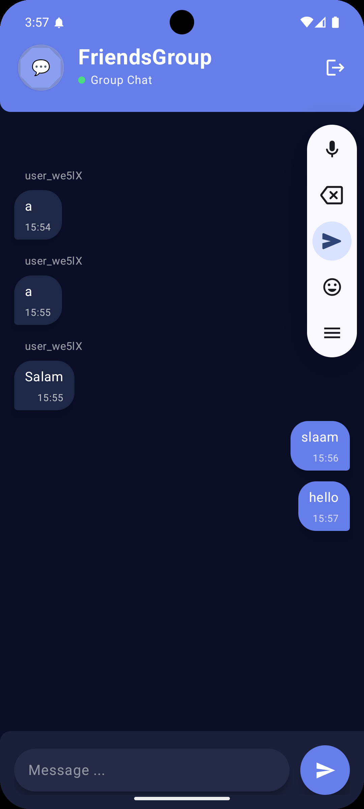
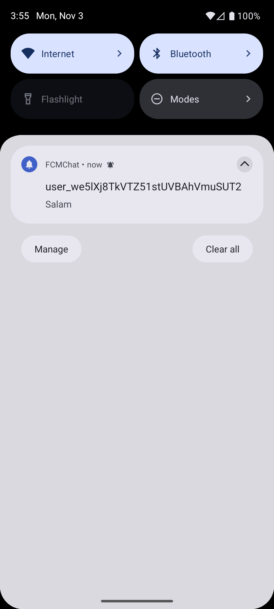

#  FirebaseCMChat (Firebase Cloud Messaging Demo + Clean Architecture + MVI + Hilt + Jetpack Compose)

> **Note:** This application was created to test and demonstrate Firebase Cloud Messaging. Its primary purpose is to showcase how to integrate and use FCM in a modern Android app.

**FCMChat** is a modern Android chat application built with Kotlin to demonstrate the power of **Firebase Cloud Messaging (FCM)**. This project serves as a practical guide to implementing real-time messaging, managing device tokens, and handling notifications using a modern Android tech stack.

The app is built using **MVI (Model-View-Intent)** and **Clean Architecture**, along with **Room**, **Kotlin Coroutines**, **Hilt**, and **Jetpack Compose** for a fully declarative, reactive, and maintainable UI.

---

## 📸 Screenshots & Demo
| Demo/GİF | 
|--------------|
|  |

| FCM Permission | Home | Notification |
|-----------|-------------|-------------|
|  |  | |


---

## 🏠 App Screens and Functionality

### 1. Chat Screen
- **Real-time Messaging:** Send and receive messages instantly.
- **User List:** See a list of all registered users.
- **Targeted Messaging:** Select a user to send a message directly to their device using their FCM token.

### 2. Notifications
- **Push Notifications:** Receive notifications when the app is in the background or foreground.
- **Custom Notification Icon:** Includes a custom icon for notifications.

---

## 🧠 Technologies Used

| Technology | Purpose |
|------------|---------|
| Kotlin | Core programming language |
| Firebase Cloud Messaging (FCM) | Real-time push notifications and messaging |
| Kotlin Coroutines | Async tasks and real-time flows |
| Flow / StateFlow | Reactive streams for UI updates |
| MVI | Unidirectional state management |
| Clean Architecture | Separation of concerns (UI, Domain, Data) |
| Hilt | Dependency Injection |
| Jetpack Compose | Declarative UI |
| Room Database | (Optional, if you add local storage) |
| ViewModel | UI-related data management |
| Jetpack Navigation | Screen transitions |
| Material Design 3 | UI design system |

---

## ⚙️ Core Features

✅ **FCM Integration:** Demonstrates sending/receiving messages and handling tokens.
✅ **Real-Time Chat:** Live messaging between users.
✅ **Clean Architecture:** Easy to maintain, test, and scale.
✅ **MVI Pattern:** Predictable, debuggable state management.
✅ **Dependency Injection:** Hilt for modularity.
✅ **100% Kotlin & Compose:** A fully modern Android app.

---

## 🧱 Project Architecture

### 1. UI Layer (Presentation)
- **Screens & ViewModels:**
  - `ChatScreen` → `ChatViewModel`
- **State Management:** The feature defines `State`, `Event`, and `Effect` classes for unidirectional data flow.

### 2. Domain Layer
- **Use Cases:**
  - `GetAllTokensUseCase`: Fetches all user FCM tokens.
  - `GetCurrentUserUseCase`: Gets the current user's information.
  - `GetMessagesUseCase`: Retrieves chat messages.
  - `SendMessageUseCase`: Sends a message via FCM.
- Pure Kotlin business logic, independent of UI/Data layers.

### 3. Data Layer
- **Repositories:** `ChatRepositoryImpl`
- **Data Sources:**
  - **Remote:** Firebase/FCM for sending messages.
  - **Local:** (If applicable) Room for caching.
- **Mappers:** Converts data models to domain models.

---

## 🚀 Getting Started

1.  **Clone the repository:**
    ```bash
    git clone <your-repository-url>
    ```
2.  **Open in Android Studio.**
3.  **Configure Firebase:**
    - Create a Firebase project at [console.firebase.google.com](https://console.firebase.google.com/).
    - Add an Android app to your Firebase project with the package name `com.example.fcmchat`.
    - Download the `google-services.json` file and place it in the `app/` directory.
4.  **Run the app** on an emulator or physical device.

To test push notifications, you will need two devices (or emulators) running the app. You can then select a user from the list and send them a message.


